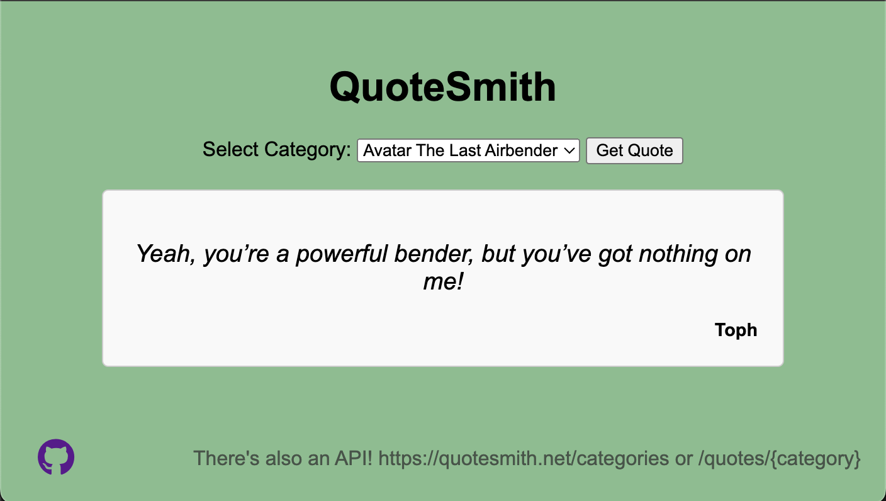
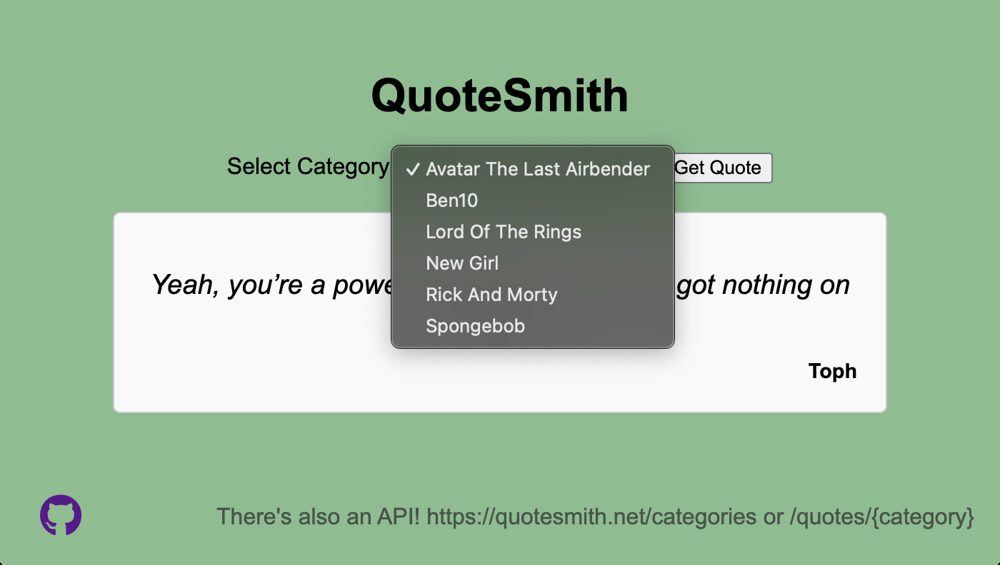

## Quotes API

A simple webpage and API that returns a random quote from the specified TV Show/Movie/Book/etc.





### Demo
A demo can be found at https://quotesmith.net along with the API:

```
curl https://quotesmith.net/quotes/avatar_the_last_airbender
{
  "author": "Uncle Iroh",
  "quote": "It is important to draw wisdom from different places. If you take it from only one place, it becomes rigid and stale."
}
```

### Installation
The recommended way to run is via a Docker container. Refer to [docker-compose.yml](docker-compose.yml) for an example compose file.

To add your own custom quotes, map a directory to the specified path in the container and add in the .txt files with the quotes. 
They must be in the format specified above.

DockerHub link: https://hub.docker.com/r/kalmonipa/quotesmith

### Development
Refer to [CONTRIBUTING.md](CONTRIBUTING.md)
